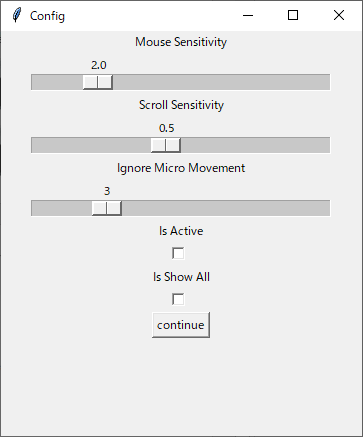

# Air Mouse

マウスの代わりに、カメラを使ってマウスを操作するアプリ

## Features

- 手の動きをトラッキングしてマウスを操作する
- 可能な操作
  - クリック
  - ドラッグ
  - スクロール
- Windows 10, Mac で動作確認済み

## Installation

```bash
git clone https://github.com/asterisk-cn/air-mouse.git
cd air-mouse
pip install -r requirements.txt
```

## Usage

### 1. Start

```bash
python air-mouse.py
```

### 2. Settings



- Mouse Sensitivity: マウスの感度
- Scroll Sensitivity: スクロールの感度
- Ignore Micro Movement: 移動平均の強度
- Active: 起動時のアプリの有効/無効
- Show Debug: デバッグ画面の表示

Start を押すと、

> **Note**
> 実行中に
>
> - A キー: アプリの有効
> - D キー: アプリの無効
> - C キー: 設定画面に戻る

### 3. Mouse Operation

- 移動: 手を広げる
- 左クリック: 親指・人差し指を曲げる
- 右クリック: 中指・薬指・小指を曲げる
- ダブルクリック: 人差し指・中指・薬指を曲げる
- スクロール: 手を握る

> **Note**
> 上記にない手の形は無視される

### 4. Exit

ターミナルで Ctrl + C  
ウィンドウがアクティブな状態で Q キーを押す  
設定画面で閉じるボタンを押す

## License

MIT
